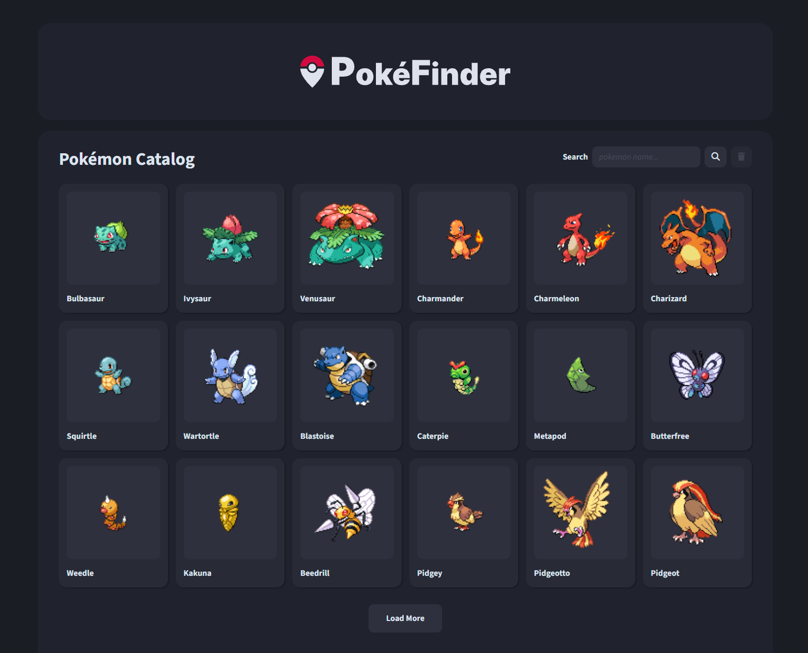

# PokéFinder

This project is a web application that allows users to browse and view details of Pokémon. The application is built with Angular on the frontend and NestJS on the backend, utilizing caching to optimize performance and reduce API calls to the PokéAPI.

Credits for Pokémon data goes to [PokéAPI](https://pokeapi.co/).



## Features

* **List Pokémon:** View a list of Pokémon with pagination support.
* **Search:** Search pokémon by name.
* **View Details:** Click on a Pokémon to view detailed information.
* **Optimized Performance:** Backend caching with NestJS and Redis to reduce API calls and improve response times.
* **Dockerized:** The application is fully dockerized, considering production and development environments.

## Missing Improvements

* The pokémon details page is barebones, missing extra data such as abilities, battle moves, evolution chain and others.
* Add unit and integration tests.
* Add CI with github actions to run automated tests.
* Error handling is lacking in some places, especially the backend.
* Missing type definitions for responses from PokéAPI.
* Responsive design and mobile UX.

## Prerequisites

If running the frontend and backend manually instead of using Docker:

* [Node.js v20](https://nodejs.org/en)
* [Redis](https://redis.io/)

Docker is optional but highly recommended:

* [Docker](https://www.docker.com/)

## Development Setup

Clone the repository and install all dependecy packages:

```shell
cd api/
npm install

cd ../app
npm install
```

### Running using Docker

The project has both Dockerfiles inside each of the services' folders, meant for production, and a docker-compose.yml file in the root of the repository that is meant for development environments.

It instantiates both services as well as starting a Redis server for caching. It also creates the required volumes to operate with hot reloading.

To run, execute the following command in the root folder of the repository:

```shell
docker compose up
```

Then you can access http://localhost:4200 in your browser to navigate the frontend.

### Running Manually

If running the services manually, open two shell instances and run both the API and frontend app:

```shell
cd api/
npm run start
```

```shell
cd app/
npm run start
```


Then the frontend Angular application will be available at http://localhost:4200.